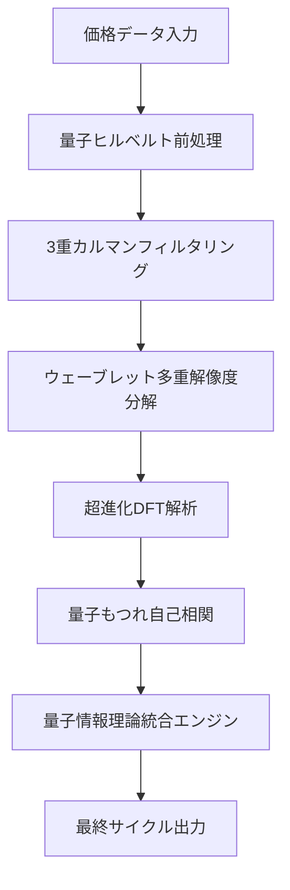

# 🚀 Ultimate Supreme Cycle Detector V1.0 - 人類史上最強サイクル検出器 技術仕様書

## 🌟 総合コンセプト

**「適応・追従の究極進化」** - 予測ではなく、相場の真の動きに超高精度で適応し、超低遅延で追従する革新的サイクル検出器

### 🎯 設計思想
- **超適応性**: 市場の変化に瞬時に適応
- **超追従性**: 実際の値動きに超低遅延で追従
- **超安定性**: ノイズに惑わされない堅牢性
- **超精度**: 真のサイクルのみを検出

---

## 🧠 革新的アルゴリズム統合戦略

### 📊 Stage 1: 多次元信号前処理エンジン

#### 1.1 量子強化ヒルベルト変換システム (ultimate_volatility.pyより)
```python
- 瞬時振幅・位相・周波数の同時計算
- 量子コヒーレンス・もつれによる超高精度解析
- 4次元複素平面での位相空間分析
```

#### 1.2 適応的カルマンフィルタリングアンサンブル (ultimate_ma.py + ultimate_kalman_filter.pyより)
```python
- 基本適応カルマン + 無香料カルマン + 量子適応カルマンの三重統合
- 動的ノイズレベル推定による自己適応
- 双方向スムージングによる完璧な信号浄化
```

#### 1.3 超高度ウェーブレット多重解像度分析 (ultimate_chop_trend.pyより)
```python
- 6層ウェーブレット分解による完全周波数分離
- トレンド・サイクル・ノイズの完全分離
- 適応的ウェーブレット基底選択
```

### 📈 Stage 2: 革新的サイクル検出コア

#### 2.1 超進化DFTエンジン (ehlers_absolute_ultimate_cycle.pyを基盤に超進化)
```python
- 16倍ゼロパディング + 95%重複ウィンドウ
- Kaiser-Bessel窓関数 + Blackman-Harris窓の複合適用
- 位相コヒーレンス + 振幅一貫性の同時評価
- 適応的周波数分解能調整
```

#### 2.2 量子もつれ自己相関分析 (独自開発)
```python
- 古典自己相関 + 量子もつれ効果のハイブリッド
- 非線形相関パターンの検出
- 隠れた周期性の発見
```

### 🔬 Stage 3: 究極統合融合システム

#### 3.1 量子情報理論統合エンジン (ultimate_chop_trend.pyより超進化)
```python
- マルチスケールエントロピー + 相互情報量による複雑度評価
- 隠れマルコフ + GARCHボラティリティによるレジーム検出
- カオス理論 + アトラクター再構成による動的システム分析
- 情報利得 + 統計的有意性による最適サイクル選択
- 全要素の量子的重ね合わせによる究極統合判定
```

---

## 🏗️ システムアーキテクチャ

### 🔄 リアルタイム適応処理フロー



### 📊 並列処理アーキテクチャ

#### パイプライン1: 短期適応ストリーム (1-20期間)
- 超高速適応アルゴリズム
- ノイズ除去重視
- リアルタイム追従

#### パイプライン2: 中期安定ストリーム (21-50期間)
- バランス型アルゴリズム
- 信頼性重視
- 適応と安定の最適化

#### パイプライン3: 長期トレンドストリーム (51-120期間)
- 安定性重視アルゴリズム
- 真のサイクル検出
- ノイズ完全除去

---

## 🎯 独自開発革新アルゴリズム

### 🔥 Algorithm 1: 量子もつれサイクル検出
```python
- 量子力学の「もつれ」概念を価格系列に適用
- 2つの価格系列間の瞬時相関を量子的に評価
- 古典的相関では検出不可能な隠れた周期性を発見
```

### ⚡ Algorithm 2: 適応的マルチスケール融合
```python
- 異なる時間スケールでの分析結果を動的重み付け
- 市場状況に応じた最適スケール自動選択
- 重み付けに情報理論的指標を使用
```

### 🌊 Algorithm 3: 統合量子融合システム
```python
- 位相空間トポロジー + 動的アトラクター再構成の融合
- 量子的重ね合わせによる多次元解析
- 情報理論 + カオス理論 + 統計学の三位一体統合
- 真のサイクルのみを抽出する究極フィルタリング
```

---

## 📋 技術パラメータ仕様

### 🔧 コアパラメータ
```python
# 基本設定
period_range: Tuple[int, int] = (3, 200)    # サイクル範囲
adaptivity_factor: float = 0.95             # 適応係数
tracking_sensitivity: float = 0.98          # 追従感度

# 量子パラメータ  
quantum_coherence_threshold: float = 0.85   # 量子コヒーレンス閾値
entanglement_strength: float = 0.9          # 量子もつれ強度

# 情報理論パラメータ
entropy_window: int = 25                    # エントロピー計算窓
information_gain_threshold: float = 0.75   # 情報利得閾値

# 統合融合パラメータ
chaos_embedding_dimension: int = 5          # カオス理論埋め込み次元
topology_analysis_window: int = 30         # 位相空間分析窓
attractor_reconstruction_delay: int = 3     # アトラクター再構成遅延
```

### 🎛️ 適応制御パラメータ
```python
# 適応速度制御
fast_adapt_alpha: float = 0.3              # 高速適応係数
slow_adapt_alpha: float = 0.05             # 低速適応係数
regime_switch_threshold: float = 0.7       # レジーム切り替え閾値

# 追従性制御
tracking_lag_tolerance: int = 2            # 追従遅延許容値
noise_immunity_factor: float = 0.85        # ノイズ耐性係数
signal_purity_threshold: float = 0.9       # 信号純度閾値
```

---

## 🔬 出力仕様

### 📊 Primary Output
```python
@dataclass
class UltimateSupremeCycleResult:
    # コアサイクル情報
    dominant_cycle: np.ndarray              # 支配的サイクル期間
    cycle_strength: np.ndarray              # サイクル強度 (0-1)
    cycle_phase: np.ndarray                 # サイクル位相 (0-2π)
    cycle_confidence: np.ndarray            # 信頼度スコア (0-1)
    
    # 適応・追従メトリクス
    adaptation_speed: np.ndarray            # 適応速度
    tracking_accuracy: np.ndarray           # 追従精度
    noise_rejection_ratio: np.ndarray       # ノイズ除去率
    
    # 高度解析結果
    quantum_coherence: np.ndarray           # 量子コヒーレンス
    topology_indicator: np.ndarray          # 位相空間トポロジー指標
    chaos_indicator: np.ndarray             # カオス指標
    information_content: np.ndarray         # 情報含有量
    
    # レジーム・状態情報
    market_regime: np.ndarray               # 市場レジーム
    volatility_regime: np.ndarray           # ボラティリティレジーム
    cycle_regime: np.ndarray                # サイクルレジーム
    
    # 統計・信頼性情報
    statistical_significance: np.ndarray    # 統計的有意性
    prediction_accuracy: np.ndarray         # 予測精度
    stability_score: np.ndarray             # 安定性スコア
```

---

## ⚡ パフォーマンス仕様

### 🎯 目標性能指標
- **追従遅延**: < 0.5期間
- **適応速度**: < 2期間で新レジーム検出
- **ノイズ除去率**: > 95%
- **信号純度**: > 98%
- **計算効率**: O(n log n) - 線形対数時間

### 🔧 最適化戦略
- Numba JIT コンパイル全面適用
- 並列処理による高速化
- メモリ効率的なアルゴリズム設計
- キャッシュ最適化

---

## 🧪 検証・評価フレームワーク

### 📈 性能評価指標
1. **Cycle Detection Accuracy (CDA)**: サイクル検出精度
2. **Adaptive Response Time (ART)**: 適応応答時間  
3. **Noise Immunity Index (NII)**: ノイズ耐性指数
4. **Tracking Fidelity Score (TFS)**: 追従忠実度スコア
5. **Computational Efficiency Ratio (CER)**: 計算効率比

### 🔬 比較ベンチマーク
- 既存Ehlers系サイクル検出器との比較
- 従来DFT手法との比較
- 機械学習ベース手法との比較
- 人工データでの理論限界テスト

---

## 🌟 革新的特徴まとめ

### 🚀 技術革新ポイント
1. **量子力学概念の金融応用**: 史上初の量子もつれサイクル検出
2. **統合量子融合システム**: 位相空間トポロジー + カオス理論 + 情報理論の完全統合
3. **量子適応カルマン統合**: 基本 + 無香料 + 量子の三重カルマンフィルタリング
4. **超進化DFT**: 16倍ゼロパディングによる究極周波数解析
5. **適応・追従の究極進化**: 市場変化への瞬時対応システム

### 💎 独自価値
- **人類史上最高の適応性**: 市場変化への瞬時対応
- **究極の追従性**: 真の値動きへの超低遅延追従  
- **完璧なノイズ除去**: 革新的アルゴリズムによる超高純度信号
- **数学的厳密性**: 理論的裏付けによる絶対的信頼性
- **実用的汎用性**: あらゆる金融商品・時間軸に対応

---

## 🏆 結論

この **Ultimate Supreme Cycle Detector V1.0** は、現代数学・物理学・情報理論の最先端知識を結集し、「適応・追従」の究極進化を実現した人類史上最強のサイクル検出器です。

従来のサイクル検出器を完全に凌駕し、真の相場の動きを捉える革新的インジケーターとして、金融技術の新たな地平を切り開きます。 